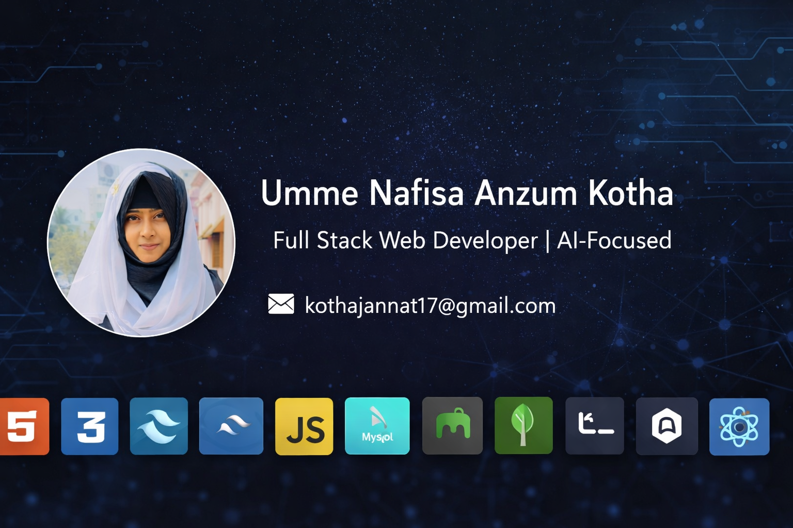

  

<h1 align="center">Hi 👋, I'm Umme Nafisa Anzum Kotha</h1>
<h3 align="center">Aspiring Full Stack Developer | Backend-Focused | AI-Driven Web Enthusiast</h3>

---

## 🧭 About Me

I am a passionate web developer focused on building scalable, efficient, and user-friendly web applications. I enjoy solving real-world problems through clean backend architecture, secure authentication systems, and thoughtful UI design.

I am particularly interested in **AI-powered web applications**, where intelligent systems integrate with modern backend technologies to create meaningful digital solutions.

I continuously challenge myself to learn new technologies and improve my problem-solving ability through hands-on development.

---

## 🛠️ Current Activities

- 🔭 Building full-stack applications using **Node.js, Express, and MongoDB**
- 🌱 Currently learning **React and Next.js** for modern frontend development
- 🧠 Exploring **AI integration** in web systems
- 📚 Improving backend logic, authentication, and system design concepts

---

## 💻 Tech Stack

### 🧠 Languages
C • C++ • Java • JavaScript • HTML5 • CSS3 • Python  

### ⚙️ Backend & Database
Node.js • Express.js • MongoDB • MySQL • Firebase • JWT  

### 🎨 Frontend & Styling
Tailwind CSS  

### 🛠️ Tools & Platforms
Git • GitHub • Postman • Jira • Trello • Vercel • Netlify • Figma • Canva  

---

# 🚀 Featured Projects

---

### 🔹 Metro Booking & Management Web Application  
**Full-stack urban transit platform**

- Ride booking & fare calculation  
- Secure JWT authentication  
- QR-based digital ticket system  
- OTP verification & user dashboard  

**Tech Used:** Node.js, Express.js, MongoDB, Firebase, Tailwind CSS  

🔗 Live Demo: https://mrt-web-app-delta.vercel.app/  
💻 GitHub: https://github.com/Kothamoni/MrtWebApp  

---

### 🔹 Banglar Teshla Rickshaw Booking Web Application  
**Electric rickshaw booking and monitoring system**

- Real-time booking logic  
- User authentication  
- Booking management system  
- Smart fare calculation  

**Tech Used:** Node.js, Express.js, MongoDB, Firebase, Tailwind CSS  

🔗 Live Demo: https://banglar-teshla-rickshaw-booking-app.vercel.app/  
💻 GitHub: https://github.com/Kothamoni/Banglar-Teshla-Rickshaw-Booking-App-  

---

### 🔹 Dental Clinic Management System  
**Full-stack clinic management platform**

- Appointment scheduling  
- Patient & doctor record management  
- Admin dashboard  
- Backend data handling  

**Tech Used:** Node.js, Express.js, MongoDB, Tailwind CSS  

🔗 Live Demo: https://dentist-web-application.vercel.app/  
💻 GitHub: https://github.com/Kothamoni/Dentist-Web-Application  

---

### 🔹 Study Material Detection with AI  
**AI-powered classification web app**

- Detects types of study materials  
- TensorFlow-based model integration  
- Flask backend API  
- Real-time prediction system  

**Tech Used:** Python, TensorFlow, Flask  

🔗 Live Demo: https://study-material-detector-using-ai-d9.vercel.app/  
💻 GitHub: https://github.com/Kothamoni/Study-Material-Detector-Using-AI  

---

## 📈 What I Bring

- Strong backend fundamentals  
- Clean API architecture  
- Secure authentication implementation  
- Problem-solving mindset  
- Continuous learning attitude  
- Team collaboration & project management exposure  

---

## 🌐 Connect With Me

📧 Email: kothajannat17@gmail.com  
💼 LinkedIn: https://www.linkedin.com/in/umme-nafisa-anzum-kotha-2063581ba  
🌍 Portfolio: https://portfolio-of-nafisa.vercel.app/  

---

## 🎯 Career Goal

I am actively seeking a **Full Stack Developer Internship** where I can:

- Contribute to real-world production systems  
- Strengthen backend engineering skills  
- Work with experienced developers  
- Transition into a long-term full-time opportunity  

---

  ⭐ If you find my projects interesting, feel free to explore and connect!

